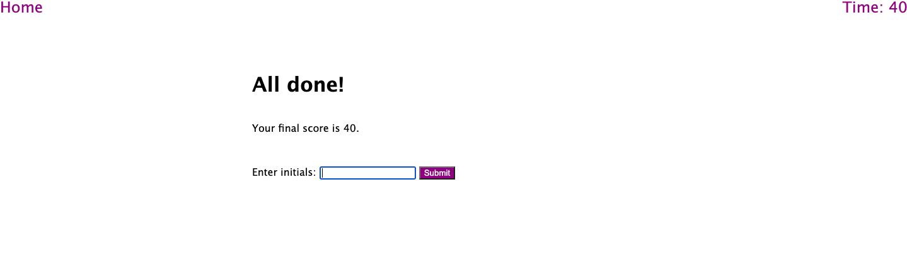

# Trivia Game
Welcome to the trivia game! You will have 60 seconds to answer 5 fun fact questions. 

Your final score will be the time left on the timer, so the higher the score, the better! Read the directions for how to play the game. 
## Directions
1. Click on the Start button to begin playing
2. Select the answer you think is correct for each question 

Note: if the answer is incorrect, it will display a message and take off 5 seconds on the timer!

3. When the timer is at 0 or all questions have been answered, the end game page will show up with your score and a box to input your initials.
4. After typing in your initials, click on the submit button.
5. The highscores page will show up with a list of all high scores 
6. You can either play again, by clicking on the Go Back button, or you can clear the highscores board by clicking on the Clear Highscores button.

## Credits
Code created by anicrob with architecture assistance from a tutor at UNC. 
## Screenshots
Start page

End Game page

## Link to Repo and Deployed application
Link to Repo: https://github.com/anicrob/week-4-challenge

Link to deployed application: https://anicrob.github.io/week-4-challenge/